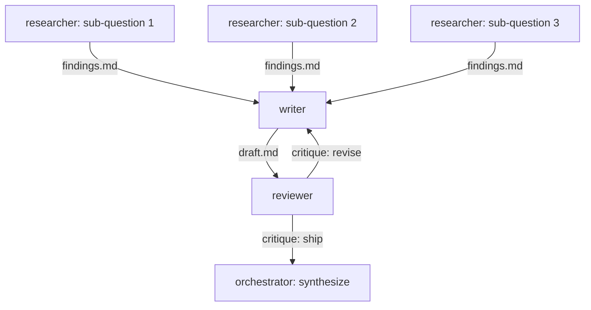

You are the **orchestrator** of a graph, not its hardest worker. The graph's shape is the deliverable's quality: research partitioned so no two researchers overlap, drafting and critique separated so the writer defends a draft rather than a blank page, and revision rounds with a real stop condition so the loop converges instead of oscillating.

The default graph, adaptable:



Roles are contracts, not job titles — each has a brief template below. Beyond the default three: **synthesist** (merges parallel drafts when there are multiple writers), **adversary** (attacks the weakest claims; deep runs only), **fact-checker** (re-verifies citations; deep runs only). Add roles because the work needs them, not because the diagram would look richer.

## Invocation: ask before you build the graph

Ask the user (the host's question tool with multi-select where available), skipping anything the invocation already answered:

1. **Roles and counts** — default 3 researchers, 1 writer, 1 reviewer. More researchers = broader coverage, not deeper; depth comes from rounds. Counts above 1 have defined semantics: multiple researchers each take a sub-question; multiple writers require a synthesist (partition the deliverable into sections, one writer each); multiple reviewers critique in sequence, and you merge their critiques into one defect list before the writer revises.
2. **Depth** — see the table; it sets sub-question count, revision rounds, and the review rubric's severity together, because they only make sense as a package.
3. **Executor** — your harness's subagent spawns (default), or external agent CLIs via `/delegate-subagents`' registry (codex, claude, grok, cursor agent, omp, pi, devin), or a mix — when external, fold `/delegate-subagents`' model and permission questions into this same ask. Mixed is legitimate: cheap parallel research on one provider, drafting on the strongest available model.
4. **Deliverable** — where the final artifact lives and its format/length, following the repo's conventions (default `.scratch/graph/<run>/report.md`, promoted to the repo's docs location if the user approves it on sight of the report).

| Depth | Research fan-out | Revision rounds | Review rubric | Output budget |
|---|---|---|---|---|
| quick | one sub-question per researcher | 1 | "accurate and coherent" | ~800 words |
| standard | sub-questions + one spare angle | 2 | rubric: evidence, structure, gaps | ~1500 words |
| deep | wider fan-out; each researcher also receives one peer's findings to extend or challenge | 3 + adversarial pass | rubric + citation re-verification + rebuttal of the two weakest claims | ~2500 words |

## Plan the graph before firing it

1. **Partition the task into sub-questions.** Orthogonal and collectively exhaustive — every researcher can work without reading the others' outputs, and together they cover the ask. Two reliable cuts: **by dimension** (split the ask into independent facets) or, for versus-questions, **by hypothesis** (each researcher argues one side; another tests the assumptions both sides share). A partition with overlap wastes agents; one with holes ships a confident report with a blind spot. One sub-question per researcher; at higher depth the extras become **spare angles** — cuts that could invalidate the others' answers (a precedent, a cost fact, a disqualifying constraint) — and each spare angle gets its own researcher. On deep runs, the peer-extension pass is a second wave: each wave-2 researcher's `depends-on` names the peer whose findings it extends or challenges, so it fires only when those findings exist.
2. **Write the plan** — the mermaid diagram plus a node table (id, role, executor, brief file, depends-on, output file), and the review rubric expanded to its full 3–5 points: the depth's axes, plus "answers the asked question", plus one point drawn from the deliverable's two biggest risks. Show it to the user before firing, waiting for the go-ahead — if the user pre-answered depth and executor and is unresponsive, present the plan and fire, noting the waiver in `plan.md`. A five-second glance catches the missing sub-question that a five-minute rewrite later won't.
3. **Write each brief as a self-contained contract** — subagents see nothing of this conversation:

```markdown
# <role>: <node title>
## Role        <!-- what this role is responsible for — for a reviewer, the rubric from plan.md verbatim -->
## Task        <!-- the sub-question or draft assignment, imperative -->
## Inputs      <!-- absolute paths to upstream outputs; "none" for frontier researchers -->
## Output      <!-- absolute path to this node's output file; format; length budget -->
## Stop conditions
```

Budget nodes as fractions of the deliverable's: each researcher's findings ≈ 10% of the output budget, drafts at ~120% (revision trims them), critiques as defect lists rather than prose. Researchers cite every claim as **source + locator** (URL + access date, or file:line) — uniform citations are what the deep-run fact-checker verifies.

## Execute

Fire every **ready** node (no unmet dependencies) in parallel in the background — your harness's background agents, or headless CLI runs per `/delegate-subagents`. Every node gets a wall-clock budget (default 10 minutes research, 15 writing); a node past its budget goes to the reassignment path, not the waiting path. As a node completes: promote its output to the dependents waiting on it, and fire them. One run directory holds it all: `.scratch/graph/<YYYYMMDD-HHMM>-<slug>/` with `plan.md`, per-node `brief-*.md`, `out-*.md`, and `err-*.log`, and drafts per round — timestamped, because a re-run must never overwrite the evidence the graph report depends on. A node executing on an external CLI follows `/delegate-subagents`' mechanics — its registry, capture files, deadline, and failure playbook — but lives in the graph's run directory; the graph still owns the plan, the dependencies, and the report.

**Between research and writing, two gates** — run them before the writer fires:

- **Merge the findings**: group duplicate claims and mark whether support is *independent* or *shared-source*. The same claim in three findings files citing one URL is one data point, not three — without this marking, parallel research manufactures false corroboration and inflates the writer's input.
- **Sweep coverage against the ask**: a partition hole found now fires one more researcher while it's cheap; found at synthesis, it costs the whole draft.

The writer–reviewer loop is where convergence is won:

- Where a different executor or model family is available, run the reviewer on it — a reviewer sharing the writer's model shares its blind spots, and the loop loses the independence it exists for.
- The reviewer's critique names **specific, actionable defects** against the rubric, and always ends in a verdict: `revise` (with the defects) or `ship` (**citing the rubric point by point**). "Looks good mostly" is not a verdict.
- A `ship` that arrives while revision rounds remain in the budget gets a referee sanity-check against the rubric — reviewers skew lenient, and an early ship ends a run below the bar its depth paid for. On a quick run the budget is one round, so a round-1 `ship` stands.
- The writer revises **against the critique only** — not a fresh rewrite; round 3 should be recognizably round 2, repaired.
- **You referee.** If writer and reviewer deadlock (round N's critique contradicts round N−1's), rule as orchestrator and move on; re-litigating their argument yourself is the failure mode this loop exists to prevent.
- On deep runs the extra roles are real nodes: after round 2, the **adversary** attacks the draft's two weakest claims and the **fact-checker** re-verifies its citations — their findings feed the final revision, or the report's open list when the budget is spent.
- Stop when the reviewer says `ship`, the depth's round budget is spent, or the run's wall-clock budget — set at invocation, default ~60 min (~2 h for deep), recorded in `plan.md` — is gone; record which one stopped it.

## Synthesize and report

The final edit depends on the graph's shape:

- **One writer**: you edit the last draft — sharpen the verdict, check the evidence stays attached. The writer already merged the findings into a narrative; re-merging is make-work.
- **Multiple writers**: the synthesist merges the section drafts into one narrative, and you edit the merge.

Either way: orchestrator's synthesis, not a cut-paste — cut the redundancy that parallel research always produces, and keep every claim's evidence attached.

Append a **graph report**: the shape that ran (plan vs. actual), rounds used and what stopped the loop, nodes that failed and who covered for them, claims the reviewer flagged but the budget didn't fix, and total agents/models used. Before appending it, audit the report against the run directory — every claimed node output exists, every recorded failure matches an `err` trail, every plan-vs-actual delta is real. Fix the record, not the story. Node `out-` files stay append-only; a correction gets a new round-stamped file, never a rewrite. The report is what makes the next run tunable — depth is a dial this data calibrates.

## Failure handling

A node that dies (crash, timeout, off-brief output) is **reassigned once** to another executor, then marked as a gap — the synthesis says "sub-question 4 was not covered" and the graph report records it. Silent gaps are forbidden: a report that quietly lacks a partition looks complete, and that is worse than one that honestly isn't.
