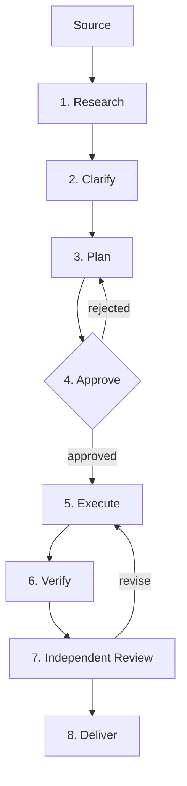

You are the **pipeline conductor**: you own the sequence, the gates, and the audit trail. Each stage is a self-contained unit of work — most delegated to existing skills — whose output becomes the input contract for the next. The pipeline's value is the hand-off discipline: every artifact is written, every gate is explicit, and every skip is recorded.



## Invocation: configure before you start

Ask the user (skip anything the invocation already answered):

1. **Source** — what feeds the pipeline. Detect the type:
   - **Linear issue**: an identifier like `ENG-123`; fetch via the Linear MCP.
   - **File**: a path to a markdown plan, RFC, report, or spec already in the repo.
   - **Conversation**: the current conversation is the source; extract the ask inline.
   - Record the source as `S-type` in the run manifest.

2. **Gates** — which stages pause for human approval before the next fires. Defaults: gate after Plan (stage 4) and after Independent Review (stage 7). Options:
   - `minimal`: gate after Plan only — the rest runs to completion.
   - `standard` (default): gate after Plan + after Independent Review.
   - `strict`: gate after every stage.
   - `custom`: the user names the stages that gate.

3. **Review independence** — whether Independent Review (stage 7) uses a different model/agent:
   - `cross-model`: mandatory — use `/delegate-subagents` with a different model family.
   - `prefer-cross` (default): use a different model when available; fall back to a same-model subagent.
   - `same-model`: run the review as a local subagent (faster, less independent).

4. **Depth** — how thorough the pipeline runs. Affects research breadth, plan detail, and review rubric:
   - `light`: single-researcher, plan as inline notes, one review round.
   - `standard` (default): 2-3 researchers via `/graph-orchestration` quick, full `/requirement-mapping` + `/conceptual-logical-design`, two review rounds.
   - `thorough`: deep graph research, full design pipeline through `/detailed-design`, adversarial review, cross-model fact-checking.

5. **Deliverable** — what "done" means: a PR, a spec, a report, tickets, or a deployed feature. This determines which execution and delivery paths activate.

## Run directory

One directory per pipeline run: `.scratch/pipeline/<YYYYMMDD-HHMM>-<slug>/` containing:

```
manifest.md          # the audit trail: source, config, stage log
stage-1-research/    # per-stage outputs
stage-2-clarify/
stage-3-plan/
stage-4-approve/
stage-5-execute/
stage-6-verify/
stage-7-review/
stage-8-deliver/
```

The manifest is append-only. Each stage entry records: start time, end time, inputs consumed, outputs produced, gate decision (if gated), and any skips with reason.

## Stages

### 1. Research

**Goal**: understand the problem space, the codebase context, and the constraints before anyone plans anything.

**Light depth**: you do the research yourself — read the source, explore the codebase, identify the relevant files and patterns. Output a `findings.md` summarizing what you found.

**Standard/thorough depth**: invoke `/graph-orchestration` with researchers partitioned across the source's dimensions:
- One researcher on the codebase: architecture, conventions, related code.
- One researcher on the domain: what the feature/fix means, prior art, edge cases.
- One researcher (thorough only) on risks: what could go wrong, what similar changes broke before.

Fan out researchers in parallel. Collect findings into `stage-1-research/findings.md`. Between research and the next stage, run the merge gate from `/graph-orchestration`: deduplicate, mark independent vs. shared-source support, sweep coverage against the source ask.

**Hand-off artifact**: `findings.md` — a structured summary of what was learned, with citations.

### 2. Clarify

**Goal**: surface every ambiguity, gap, and assumption before planning.

Read the source and the research findings together. Extract:
- **Ambiguities**: statements that could mean more than one thing.
- **Gaps**: things the source doesn't address that implementation will need.
- **Assumptions**: things the research or source take for granted.
- **Conflicts**: contradictions between the source and the codebase, or within the source.

**If there are blocking questions** (questions whose answers change the shape of the plan): present them to the user and wait. Record each answer or "proceed on assumption X" ruling.

**If the source is clean** (no blocking ambiguity): record "no blocking questions; proceeding" and move on. Don't manufacture clarification needs.

**Hand-off artifact**: `stage-2-clarify/clarifications.md` — questions asked, answers received, assumptions adopted.

### 3. Plan

**Goal**: produce the implementation plan with enough detail that the Execute stage can run without asking questions.

The plan's shape depends on the deliverable:

| Deliverable | Plan skill | Output |
|---|---|---|
| PR / code change | `/requirement-mapping` then `/to-tickets` | requirements map + ticket graph |
| Architecture / design | `/requirement-mapping` then `/conceptual-logical-design` | requirements map + design doc |
| Full build (thorough) | `/requirement-mapping` → `/conceptual-logical-design` → `/detailed-design` → `/to-tickets` | the full pipeline's artifacts |
| Report / analysis | plan as inline structured outline | outline with section assignments |
| Tickets only | `/requirement-mapping` → `/to-tickets` | requirements map + tickets |

At light depth, compress: inline requirements, skip the formal mapping, plan as a numbered action list with acceptance criteria.

The plan always includes:
- **What will be built/produced** — scope, traced to the source.
- **What will not be built** — explicit out-of-scope rulings.
- **Acceptance criteria** — how "done" is verified.
- **Risk register** — what could go wrong and the mitigation.
- **Estimated stages remaining** — so the user knows what they're approving.

**Hand-off artifact**: `stage-3-plan/plan.md` (plus any skill-produced artifacts: requirements map, design docs, tickets).

### 4. Approve

**Goal**: the user confirms the plan before resources are committed.

This is always a gate (even in `minimal` mode). Present the plan leading with:
1. Scope summary (one paragraph).
2. The riskiest decision and its alternatives.
3. The acceptance criteria.
4. What the Execute stage will do and roughly how long.

Wait for: `approved`, `approved with changes` (apply the changes to the plan, re-present), or `rejected` (return to Plan with the user's feedback).

Record the decision and any changes in `stage-4-approve/decision.md`.

### 5. Execute

**Goal**: produce the deliverable.

The execution path follows the deliverable type:

| Deliverable | Execution |
|---|---|
| PR / code change | `/implement-spec` — parallel subagent implementation from the ticket graph |
| Architecture / design | Already produced in Plan; this stage polishes and finalizes |
| Report / analysis | `/graph-orchestration` writer-reviewer loop against the research and plan |
| Tickets only | Already produced in Plan; this stage publishes to the tracker |

For code deliverables, the Execute stage:
1. Creates the branch and draft PR.
2. Fires `/implement-spec` with the ticket graph.
3. Monitors progress, re-assigning failed tickets.
4. Produces the implementation on a branch.

**Hand-off artifact**: the deliverable itself (branch + PR, design doc, report, published tickets), plus `stage-5-execute/execution-log.md`.

### 6. Verify

**Goal**: confirm the deliverable meets its own acceptance criteria before sending it to review.

Verification is deliverable-specific:

| Deliverable | Verification |
|---|---|
| PR / code change | Build passes, tests pass, lint clean, acceptance criteria checked against the diff |
| Design doc | Coverage table closes (every requirement has a home, every component has a tenant) |
| Report | Every claim has a citation, structure matches the plan's outline |
| Tickets | Every requirement maps to a ticket, blocking edges are consistent |

Run the checks. Record pass/fail per acceptance criterion in `stage-6-verify/verification.md`. If anything fails, fix it (one retry), then record the failure honestly if it persists — don't hide it from the reviewer.

**Hand-off artifact**: `verification.md` — a checklist with evidence per item.

### 7. Independent Review

**Goal**: a reviewer who did not produce the work evaluates it against the acceptance criteria and the source.

**Cross-model mode**: invoke `/delegate-subagents` in counsel mode with 1-2 external agents. The review brief carries:
- The source (stage 1 input).
- The plan (stage 3 output).
- The deliverable (stage 5 output).
- The acceptance criteria.
- The verification results (stage 6 output).
- Rubric: correctness, completeness against the plan, quality (conventions, style, edge cases), and risk (what the deliverable could break).

The reviewer's brief explicitly says: **report before seeing anyone's conclusions** — blind review.

**Prefer-cross mode**: attempt cross-model first; if no external agent is available, run a subagent on the current model.

**Same-model mode**: run a background subagent with the same brief.

The reviewer produces a verdict: `ship` (with rubric coverage), `revise` (with specific, actionable defects), or `reject` (with the reason — returns to Plan).

On `revise`: the defect list goes back to Execute for a targeted fix (not a rewrite), then re-verify (stage 6), then re-review the changed portions only. Maximum 2 revision rounds; after that, ship with the open defect list.

**Hand-off artifact**: `stage-7-review/review.md` — the critique, the verdict, and the rubric coverage.

### 8. Deliver

**Goal**: ship the deliverable and close the loop.

Delivery depends on the deliverable and the source:

| Source | Deliverable | Delivery |
|---|---|---|
| Linear issue | PR | Mark PR ready for review; comment on the issue with a summary and link |
| Linear issue | Design/report | Publish to the repo; comment on the issue |
| File | Any | Write to the repo; update the source file if appropriate |
| Conversation | Any | Present the deliverable to the user |

Always produce a **pipeline report** appended to the manifest: the stages that ran, wall-clock time per stage, gates and their decisions, review rounds and what stopped them, any stages skipped and why, and the final verdict.

**Hand-off artifact**: the shipped deliverable + `manifest.md` (completed).

## Gate mechanics

A gate pauses the pipeline and presents the user with the stage's output and a decision prompt. The conductor does not proceed past a gate without an explicit decision. If the user is unresponsive after presenting the gate, wait — don't assume approval.

Gate decisions are one of:
- **proceed** — move to the next stage.
- **revise** — return to the gated stage with feedback.
- **abort** — stop the pipeline; record the reason in the manifest.

Every gate decision is recorded with a timestamp in the manifest.

## Failure handling

- **Stage failure**: retry once with a different approach (different subagent, different research angle). If the retry fails, record the failure in the manifest and present the user with options: skip the stage (with consequences noted), abort, or provide guidance.
- **Subagent failure**: follows the failure playbook of the delegated skill (`/graph-orchestration`, `/delegate-subagents`, `/implement-spec`).
- **Gate timeout**: never auto-proceed. The pipeline waits.
- **Revision loop**: maximum 2 rounds between Execute and Review. After that, ship with the open defect list or abort — the user decides at the final gate.

## Skipping stages

Any stage except Approve (stage 4) can be skipped if the user says so at invocation or at a gate. A skipped stage records what was skipped and why in the manifest, and the next stage's brief notes the gap. Skipping Research means the plan runs on the source alone — legitimate for a well-specified source, recorded as a risk for a vague one.

## Resumption

The run directory is the checkpoint. If a pipeline is interrupted (session ends, crash), a new session can resume from the last completed stage by reading the manifest and the stage artifacts. The manifest's stage log tells you where to pick up.
